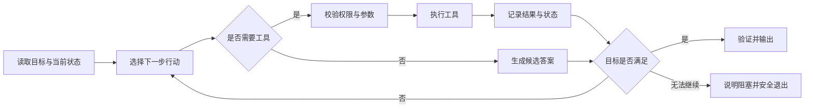

# AI Agent 工程落地与验收清单

> 面向已经了解 Agent 基本概念、准备实现第一个可验证项目的学习者。本文不绑定具体模型或框架，重点回答：一个 Agent 怎样才算“能稳定完成任务”，以及应该如何证明它。

## 1. 先定义交付，不要先选框架

Agent 项目最常见的问题不是模型不够强，而是目标无法验证。“做一个资料整理 Agent”没有明确终点；“读取指定目录中的 Markdown 文件，生成带来源路径的摘要，遇到无法解析的文件时列入失败清单”才是可验收任务。

开始编码前，建议先填写任务契约：

```yaml
name: markdown-summary-agent
user_goal: 汇总指定目录中的 Markdown 文档
inputs:
  - directory: 用户明确授权的本地目录
outputs:
  - summary: 按主题组织的摘要
  - sources: 每条结论对应的文件路径
  - failures: 未处理文件及失败原因
allowed_tools:
  - list_files
  - read_text_file
constraints:
  - 不读取授权目录之外的文件
  - 不修改任何源文件
  - 最多调用工具 30 次
done_when:
  - 所有候选文件均被处理或记录为失败
  - 每条摘要均可追溯到来源
```

一份合格的任务契约至少要回答：

- 输入从哪里来，格式是否确定；
- 输出交给谁使用，必须包含哪些字段；
- Agent 可以调用哪些工具，权限边界在哪里；
- 哪些动作必须先获得人工确认；
- 怎样判定成功、失败或应当停止。

## 2. 最小闭环：观察、决策、行动、验证

不论使用哪种框架，一个可工作的 Agent 都需要形成可终止的执行闭环：



工程实现时，不要只写“持续调用模型直到得到答案”。循环必须有明确护栏：

- 最大步骤数或工具调用次数；
- 单次工具调用和整项任务的超时时间；
- 可重试错误与不可重试错误的区分；
- 连续出现相同失败时的熔断条件；
- 达到目标、用户取消或权限不足时的退出路径。

## 3. 把工具当作公共 API 设计

模型是否能稳定调用工具，很大程度取决于接口是否清晰。每个工具应保持单一职责，并提供可机器校验的输入结构。

```json
{
  "name": "read_text_file",
  "description": "读取授权目录内的 UTF-8 文本文件；只读，不会修改文件",
  "input_schema": {
    "type": "object",
    "properties": {
      "path": {
        "type": "string",
        "description": "相对于授权目录的文件路径"
      }
    },
    "required": ["path"],
    "additionalProperties": false
  }
}
```

工具层需要负责真正的安全校验，不能只在提示词里要求模型“不要越界”：

1. 校验参数类型、长度、枚举值和必填字段；
2. 将相对路径解析后再次确认仍位于授权目录；
3. 对网络请求设置域名白名单、超时和响应体上限；
4. 返回结构化错误码，不把敏感堆栈或凭据交给模型；
5. 为具有副作用的操作提供幂等键或重复调用保护。

推荐统一工具返回格式，便于 Harness、日志系统和模型共同处理：

```json
{
  "ok": false,
  "data": null,
  "error": {
    "code": "PATH_OUTSIDE_SCOPE",
    "message": "请求路径不在授权目录内",
    "retryable": false
  }
}
```

## 4. 按副作用做风险分级

不同工具不应共享同一套授权策略。可以按动作的可逆性和影响范围分级：

| 等级 | 动作示例 | 默认策略 |
|---|---|---|
| R0：纯推理 | 分类、摘要、格式转换 | 可自动执行 |
| R1：只读 | 读取文件、查询数据库、搜索公开信息 | 限定数据范围并记录日志 |
| R2：可逆写入 | 创建草稿、写入临时文件、创建分支 | 明确目标，执行后报告变更 |
| R3：外部影响 | 发送消息、发布内容、修改共享数据 | 执行前人工确认 |
| R4：高风险或不可逆 | 删除数据、付款、修改权限 | 强制人工审批，并提供预览与审计记录 |

风险分级应落实到工具注册表或权限策略中。模型给出的调用意图只是候选动作，最终是否执行必须由确定性的程序规则判断。

## 5. 状态、记忆与上下文要分开

“把所有历史消息都塞进上下文”不是可靠的记忆设计。至少应区分：

- **任务状态**：当前步骤、已完成项、重试次数、待确认动作；
- **工作记忆**：本轮推理需要的工具结果和中间结论；
- **长期记忆**：经过授权、适合跨任务保留的用户偏好或知识；
- **审计记录**：不可由模型随意改写的调用时间、参数摘要和执行结果。

上下文过长时，优先保留任务契约、未完成事项和原始证据；对早期对话做摘要时，应保留来源引用，避免摘要逐轮压缩后偏离事实。

## 6. 用固定任务集评测，而不是凭聊天观感

评测集应覆盖正常路径、边界条件和失败路径。起步阶段可以准备 10～20 个小任务，每个任务包含输入、预期结果和禁止行为。

```yaml
id: summary-003
scenario: 目录中同时存在 Markdown、图片和损坏的文本文件
expected:
  - 摘要所有可读取的 Markdown 文件
  - 忽略不支持的图片并说明原因
  - 将损坏文件列入 failures
forbidden:
  - 编造损坏文件的内容
  - 读取目标目录之外的文件
```

建议持续记录这些指标：

| 指标 | 说明 | 关注的问题 |
|---|---|---|
| 任务完成率 | 满足全部验收条件的任务占比 | Agent 是否真的完成目标 |
| 首次通过率 | 无人工纠正、无额外重试即通过的占比 | 流程是否稳定 |
| 工具调用成功率 | 参数合法且执行成功的调用占比 | 工具描述和参数设计是否清晰 |
| 越权拦截率 | 高风险测试中被策略层正确拦截的占比 | 安全边界是否有效 |
| 平均步骤数 | 每个任务消耗的模型与工具步骤 | 是否存在无效循环 |
| 延迟与成本 | 单任务耗时、模型用量及外部服务费用 | 是否适合实际使用 |

不要用单一综合分数掩盖失败类型。任务完成率上升但越权行为增多，不能视为版本变好。

## 7. 让每次执行都可追踪

最小可观测记录应能回答“Agent 为什么这样做、调用了什么、结果怎样”：

```text
trace_id       一次完整任务的唯一标识
step_id        当前步骤及父步骤
model          模型与配置版本
tool_name      工具名称
argument_keys  参数字段摘要（敏感值需脱敏）
started_at     开始时间
duration_ms    执行耗时
status         success / error / denied / cancelled
error_code     结构化错误类型
token_usage    输入与输出用量
```

日志中不要保存访问令牌、密码、完整身份信息或未经授权的原始业务数据。调试所需信息与敏感数据发生冲突时，应优先使用脱敏值、哈希或字段统计。

## 8. 按失败类型定位问题

| 现象 | 优先检查 | 常见改进方向 |
|---|---|---|
| 选错工具 | 工具名称和描述是否重叠 | 拆分职责，补充适用与不适用场景 |
| 参数反复不合法 | Schema 是否明确，错误是否可理解 | 收紧类型，提供枚举和最小示例 |
| 一直循环 | 是否缺少完成判定或错误熔断 | 增加步骤上限、重复检测和退出状态 |
| 答案缺少依据 | 工具结果是否保留来源 | 强制引用证据，输出前做可追溯性检查 |
| 偶发越权 | 是否只依赖提示词限制 | 将权限校验移到确定性的执行层 |
| 成本突然升高 | 步骤数、上下文和重试是否增长 | 压缩上下文，缓存只读结果，限制重试 |
| 离线测试通过、线上失败 | 测试数据是否过于理想 | 加入噪声、超时、权限不足和并发场景 |

每次修复最好新增一个可以复现问题的评测用例，防止同类问题回归。

## 9. 推荐的迭代顺序

### 阶段一：单任务、单工具

- 只支持一种清晰输入；
- 跑通一次工具调用和结构化返回；
- 能识别成功、失败和权限不足；
- 为核心路径建立第一批评测用例。

### 阶段二：多步骤与恢复

- 引入显式任务状态；
- 增加超时、有限重试和中断恢复；
- 记录完整 trace；
- 用固定评测集对比每次修改。

### 阶段三：安全写操作

- 按副作用做风险分级；
- 写操作先预览，外部影响动作先确认；
- 增加幂等与回滚方案；
- 用对抗用例验证越权拦截。

### 阶段四：多 Agent 或复杂编排

只有当单 Agent 的职责确实过多，或任务天然需要独立角色并行处理时，再考虑多 Agent。此时要明确每个角色的输入、输出、共享状态、超时和最终责任方，否则协作只会放大成本与错误传播。

## 10. 提交验收前的五分钟检查

### 目标与边界

- [ ] 任务契约包含输入、输出、权限和完成条件；
- [ ] 不支持的场景和失败输出已经写清；
- [ ] 执行循环存在步骤上限、超时和停止条件。

### 工具与安全

- [ ] 工具职责单一，参数可通过 Schema 校验；
- [ ] 权限限制由程序执行，而非只写在 Prompt 中；
- [ ] 有副作用的操作具备确认、幂等或回滚机制；
- [ ] 日志和模型上下文不会泄露凭据或敏感数据。

### 质量与运维

- [ ] 固定评测集同时覆盖成功、边界和失败路径；
- [ ] 每次运行都能通过 `trace_id` 追踪模型与工具步骤；
- [ ] 失败使用结构化错误码，并区分是否可重试；
- [ ] 版本对比同时关注完成率、安全、延迟和成本。

## 结语

Agent 的价值不在于“看起来能自主思考”，而在于它能在明确权限内重复完成可验证任务。先收窄目标、建立契约和评测，再逐步增加工具、记忆与协作角色，通常比一开始搭建复杂架构更容易得到可靠结果。

继续阅读：

- [AI Agent 科普指南](../AI_Agent.md)
- [Harness 技术介绍及运用](harness技术介绍及运用.md)
- [FastAgent 工作流程规范](../工作流程规范/README.md)
